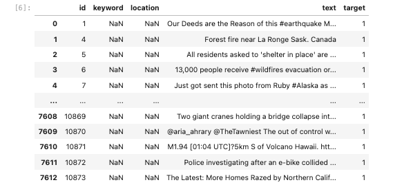
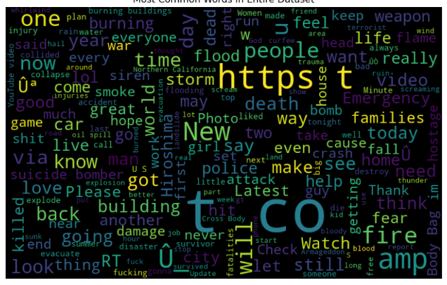
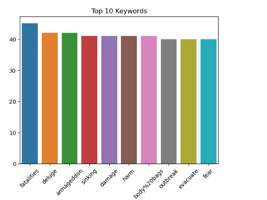
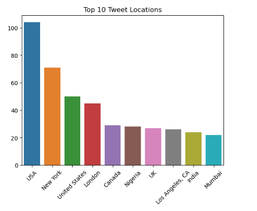
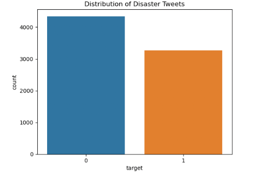
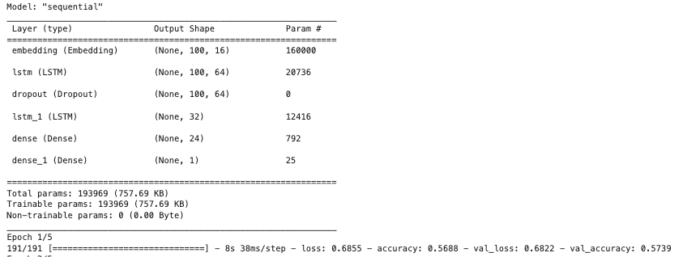

# disaster tweets
predictive NLP modeling for twitter subjects

## Introduction:
Twitter has become an important communication channel in times of emergency.
The ubiquitousness of smartphones enables people to announce an emergency they’re observing in real-time. Because of this, more agencies are interested in programatically monitoring Twitter (i.e. disaster relief organizations and news agencies).

In this competition, you’re challenged to build a machine learning model that predicts which Tweets are about real disasters and which one’s aren’t. You’ll have access to a dataset of 10,000 tweets that were hand classified. If this is your first time working on an NLP problem, we've created a quick tutorial to get you up and running.
## Data

id: tweet id
Keyword: Keywords from tweet
location: location of tweet
text: text from tweet
target: 1 = diaster tweet 0 = not diaster tweet

These features can be used and analyzed with appropriate statistical and machine learning techniques and can help in predicting an individual's medical costs.
## Exploratory Data Analysis

## Modeling

## Future Directions
refind the modeling.  The model is not performing well and needs optimumization. This is just a skeleton of an NLP project and requires more computational time and optimumization to create a well performing model.